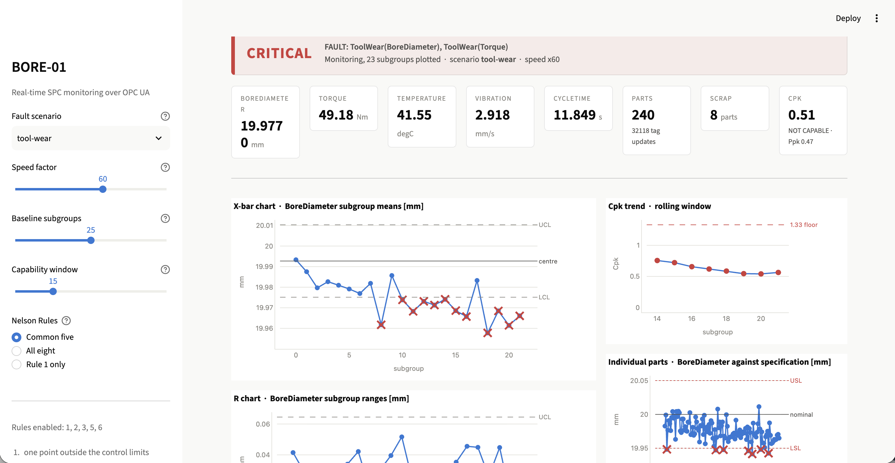
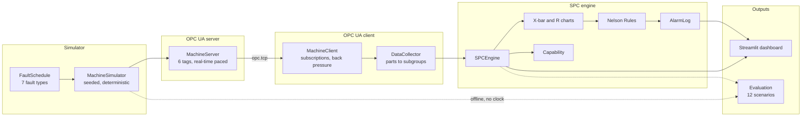

# Real-Time SPC Monitoring over OPC UA

[](https://github.com/Priyaj11/real-time-spc-opcua/actions/workflows/tests.yml)

Statistical Process Control applied to a simulated CNC boring station, with
measurements delivered over OPC UA and an operator dashboard that raises alarms
before a bad part is made.

The detection performance is **measured, not claimed**: twelve fault scenarios,
thirty replicates each, with the false alarm rate reported alongside the
detection rate. Every number below comes from `python -m spc_opcua.evaluation`,
and the raw per-run results are committed in `data/evaluation_runs.csv`.



---

## What it does

A simulated machining station (`BORE-01`) produces one part every twelve
seconds and publishes six measurements over **OPC UA** — the standard protocol
industrial equipment uses to talk to software. A client subscribes to those
tags, groups parts into subgroups of five, and runs them through a full SPC
engine:

- **X-bar and R control charts**, with limits computed from a stable baseline
  and then frozen
- **All eight Nelson Rules**, selectable, applied to both charts
- **Process capability** — Cp, Cpk, Pp, Ppk on a rolling window
- **Alarm handling** that collapses repeated rule firings into standing
  conditions an operator can actually read

Seven fault types can be injected. Four change the part itself; three change
only the reading, which is a distinction the evaluation depends on.

---

## Measured results

Twelve scenarios × 30 replicates. Each replicate is a complete production run:
25 subgroups of healthy production, control limits frozen, then a fault
beginning on the very next part and monitored for 60 subgroups (300 parts,
about one hour of production).

### Detection against false alarms

This is the headline, and it is one table rather than one number:

| Rule set | Faults detected | Rate | Median latency | False alarms / subgroup | ARL₀ |
|---|---|---|---|---|---|
| Rule 1 only | 302 / 330 | 92% | 2 subgroups | **1.56%** | 64 |
| Common five (1,2,3,5,6) | 330 / 330 | **100%** | 3 subgroups | 5.78% | 17 |
| All eight | 330 / 330 | 100% | 3 subgroups | 6.06% | 17 |

ARL₀ is the in-control average run length: subgroups between one false alarm
and the next, on a machine with nothing wrong with it.

**A 100% detection rate is not, on its own, a good result.** With the common
five rules a perfectly healthy machine raises an alarm in 83% of one-hour
windows, so a detector that flags almost everything will of course catch every
fault. Rule 1 alone misses 8% of faults but wrongly flags one point in 64
rather than one in 17. Which end of that trade-off a plant wants depends on
what it costs to stop a line against what it costs to ship a bad part. The
software's job is to measure both honestly and let someone else decide.

All eight rules buy nothing over the common five here — same detection, same
latency, more false alarms — which is why the dashboard defaults to the common
five.

### Per scenario, common five rules

```
scenario          kind     detect med sg parts worst warning scrap avoid per sg
-------------------------------------------------------------------------------
healthy           healthy     83%     20   100    59       -     0     -     6%
tool-wear-slow    process    100%     15    75    24   175.5    10  100%    65%
tool-wear-fast    process    100%      9    45    17     110   898  100%    83%
mean-shift-1sigma process    100%      3    15     9     164     7  100%    93%
mean-shift-2sigma process    100%      1     5     2      31   156   99%   100%
mean-shift-3sigma process    100%      1     5     1     1.5  1125   98%   100%
variance-2x       process    100%      1     5     9       8   357   97%    84%
variance-3x       process    100%      1     5     3    -0.5  1498   98%    98%
outlier-burst     process    100%     13    65    19      -4   115   83%    14%
sensor-drift      sensor     100%     11    55    15       -     0     -    83%
sensor-stuck      sensor     100%      3    15     3       -     0     -    97%
sensor-noise      sensor     100%      2    10     5       -     0     -    90%
```

`warning` is the number of parts made between the alarm and the first part that
is genuinely out of specification. Positive means the system warned before
anything was actually wrong, which is the whole argument for control charts
over end-of-line inspection. Median across faulted scenarios: **19.5 parts**.

`avoid` is the share of a scenario's scrap that was produced *after* the alarm
fired — 98.2% overall. That is a clearly stated counterfactual, not a
measurement: it assumes the line stops when the alarm fires, which is a
management decision, not a software one.

### The most interesting result

Look at `sensor-stuck` under rule 1 alone: **7% detection**.

A stuck gauge repeats its last reading forever. Every subgroup then has a range
of exactly zero and a mean that never moves — which to "any point beyond three
sigma" looks like a *perfect* process. It is caught only when the frozen value
happens to sit far from centre. The pattern rules find it immediately, because
a line that never moves is the least random thing a chart can show.

The most obviously broken sensor in the catalogue is nearly invisible to the
textbook rule.

### Reproducing these numbers

```bash
make evaluate    # ~6 min, writes data/evaluation_runs.csv and _summary.csv
make compare     # ~18 min, the rule set trade-off table above
```

Every run is seeded from `FIRST_SEED = 1000`, so the same scenario and
replicate number always produce the same result on any machine. The tables
above were reproduced identically on macOS and Linux.

---

## Quickstart

Requires Python 3.11 or newer.

```bash
git clone https://github.com/Priyaj11/real-time-spc-opcua.git
cd real-time-spc-opcua
python3 -m venv .venv
source .venv/bin/activate          # Windows: .venv\Scripts\activate
pip install -r requirements.txt
```

No install step — the package layout is flat, so a plain clone is importable.

```bash
make dash        # the operator dashboard at http://localhost:8501
make test        # 619 tests
make             # every available command
```

| Command | What it does |
|---|---|
| `make fast` | 524 deterministic tests, ~28 s. The loop you run while coding. |
| `make test` | Everything, including real OPC UA sockets. ~2m 25s. |
| `make cov` | Coverage over the deterministic tests. |
| `make lint` | `ruff` — unused names, import order, docstrings, likely bugs. |
| `make dash` | The Streamlit operator screen. |
| `make evaluate` | The twelve fault scenarios. |
| `make compare` | Detection against false alarms, per rule set. |
| `make data` | Collect a CSV over a live OPC UA connection. |

---

## Architecture



Two paths run through the same SPC engine. The **live path** paces itself in
real time and feeds the dashboard. The **offline path** drives the same
simulator with the clock removed, which is what makes 360 production runs take
six minutes instead of fifteen hours.

### The threading problem, and how it is solved

Streamlit re-runs your entire script on every page refresh and every widget
change. An OPC UA connection cannot live like that — it is a long-running
asyncio conversation, and reconnecting it several times a second is absurd.

So the connection lives in **its own thread with its own event loop**, running
continuously. That thread owns the client, the collector and the engine, and
keeps a frozen `Snapshot` behind a lock. Streamlit re-runs as often as it likes
and only ever reads that snapshot.

> **Only the background thread writes. The UI only reads, and reads a frozen copy.**

---

## How the SPC works

**Subgroups.** Five consecutive parts form one subgroup. Plotting a subgroup
mean instead of individual parts shrinks the noise by √5 and makes a small
shift visible.

**Two phases.** The first 25 subgroups are collected and *nothing is judged* —
you cannot monitor against limits you have not calculated. Then the limits
**freeze**. A chart whose limits move with the data can never detect anything,
because the limits chase the fault.

**Control limits are not specification limits.** Control limits describe what
the process actually does; specification limits are what the customer asked
for. They are computed from the mean subgroup range using the standard `d2`
and `d3` constants. Specification limits appear on exactly one chart in this
project — the individual-parts chart — because the X-bar chart plots subgroup
means, which are narrower than single parts by √5, and drawing a part tolerance
across them makes a process look about twice as safe as it is.

**Nelson Rules** look for patterns that random variation should not produce: a
point beyond three sigma, nine in a row on one side, six rising or falling.
More rules detect faster and cry wolf more often, which is the trade-off table
above.

**Capability** (Cp, Cpk) compares the process spread to the tolerance. The gap
between Cpk (within-subgroup sigma) and Ppk (overall sigma) is a stability
signal: if Ppk is much worse, the process is moving between subgroups.

**Alarms are not violations.** Rule 2 fires on every point of a long run — one
worn-tool run produced 485 individual rule firings. Those collapse into **four**
standing alarm conditions, each raised once, counting its own occurrences and
clearing after five quiet subgroups. Showing all 485 is how you build a
dashboard nobody looks at.

---

## Project layout

```
spc_opcua/
├── config.py               machine.yaml into frozen dataclasses
├── logging_setup.py
├── simulator/
│   ├── distributions.py    seeded random draws
│   ├── machine.py          the physics: cycle, noise, thermal response
│   ├── faults.py           7 fault types, process and sensor
│   └── offline.py          the same simulator with the clock removed
├── opcua_server.py         asyncua server, 6 tags, real-time paced
├── opcua_client.py         subscriptions, back pressure, staleness
├── pipeline.py             tag updates into parts into subgroups
├── spc/
│   ├── subgroups.py        constants.py      d2, d3, A2, D3, D4
│   ├── control_charts.py   capability.py     Cp, Cpk, Pp, Ppk
│   ├── nelson_rules.py     alarms.py         raise, stand, clear
│   └── engine.py           the two phases behind one door
├── dashboard/
│   ├── live_source.py      the asyncio-to-Streamlit bridge
│   ├── charts.py           Plotly figures
│   └── app.py              the operator screen
└── evaluation/
    ├── scenarios.py        the 12 scenarios, as data
    ├── runner.py           run, measure, summarise
    └── __main__.py         the CLI
```

**7,718 lines** across 27 modules, plus **4,892 lines** of tests across 17 test
files.

---

## Testing and quality

**619 tests.** Split into lanes with pytest markers so the inner loop stays
usable:

- `make fast` — 524 deterministic tests, **28 seconds**
- `make test` — everything, including tests that open real sockets, 2m 25s

Integration markers are applied automatically by module in `conftest.py`,
because relying on people to remember a decorator is how a fast lane stops
being fast.

**Coverage is 70%**, measured over the deterministic lane, and here is exactly
where the missing 30% is:

- `opcua_client.py` 23%, `opcua_server.py` 26%, `live_source.py` 33% — these
  are exercised almost entirely by the integration tests, which are excluded
  from the coverage run. Coverage traces every executed line, which slows the
  server's publishing loop enough that a client pacing at 100× simulated time
  starves. They are *tested*; they are just not *measured*.
- The `__main__` demo blocks at the bottom of several modules.
- Error branches in `config.py` for malformed YAML.

The modules carrying the actual SPC logic score between 92% and 99%:
`engine.py` 98%, `subgroups.py` 99%, `faults.py` 97%, `charts.py` 92%.

**`ruff` runs clean** with docstring, import-order and bugbear rules enabled.
It found one real latent bug: a return annotation naming a module that was only
imported inside the function body. Harmless under
`from __future__ import annotations`, and an immediate crash for anything that
resolves type hints.

---

## Honest limitations

- **The machine is simulated.** The physics is plausible — thermal response,
  correlated noise, tool wear pushing torque up — but it is not a real spindle.
  Every number here describes how the detector performs *against this
  simulator*.
- **`scrap_avoidable` is a counterfactual, not a measurement.** It assumes the
  line stops when the alarm fires.
- **One characteristic is charted.** Bore diameter. Real stations chart several.
- **The evaluation uses a fixed baseline size and window.** Both are
  command-line options, but the headline numbers use 25 and 60.
- **No authentication on the OPC UA endpoint.** Fine for a local simulator,
  nowhere near production practice.
- **Thirty replicates per scenario** is enough to separate 92% from 100%; it is
  not enough to argue about a percentage point.

## What I would do next

- Chart several characteristics at once, with a per-tag status roll-up
- CUSUM or EWMA alongside Shewhart charts — both detect small sustained shifts
  faster than the Nelson Rules do
- A proper alarm shelving workflow, not just acknowledge
- Persist history to a database so limits survive a restart
- Certificate-based OPC UA authentication

---

MIT licensed.